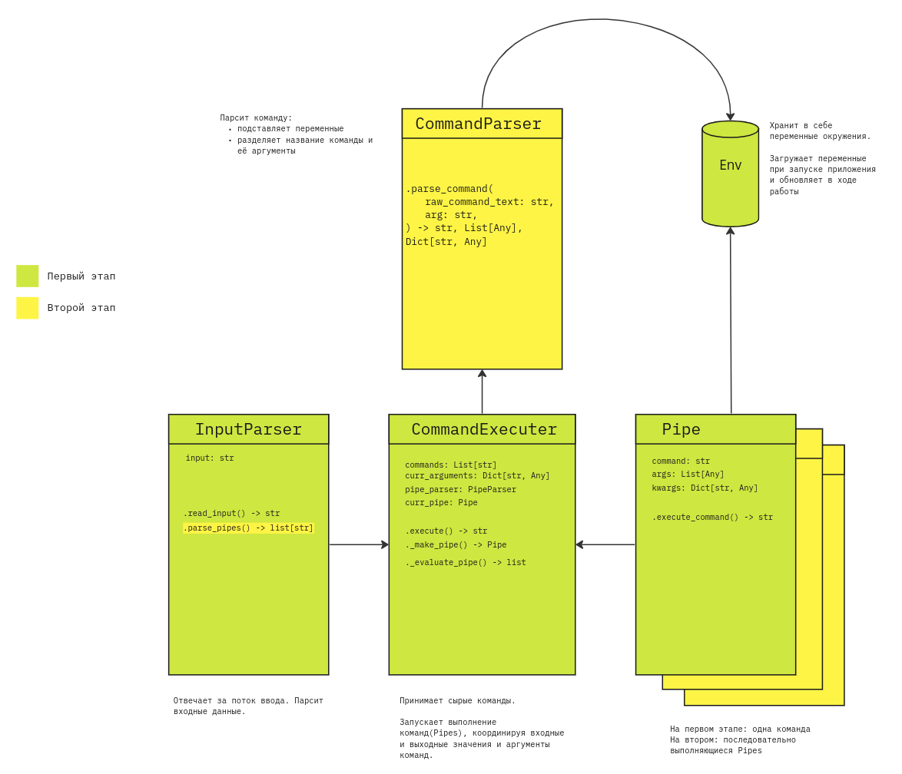

# mcs-bash

Command-Line Interface на языке Python

## Запуск

Установка необходимых зависимостей: 
```shell
% git clone git@github.com:heartmarshall/mcs-bash.git
% cd mcs-bash
% pip install -r requirements.txt
```

Запуск CLI:
```shell
% python main.py
```

## Архитектура




## Общий пайплайн

Общий пайплайн работы CLI можно описать следующими шагами:

- Препроцессинг входа
- Разбиение на исполняющую команду и её аргументы
- Обработка регулярных выражений, присвоений и кавычек
- Подстановка аргументов командной строки
- Исполнение команды вместе с обработанными аргументами

Последний пункт выполняется с использованием библиотеки языка Python **subprocess**.

Для проверки надежности работы CLI реализовыны функциональные unit-тесты для каждого класса CLI, которые можно найти в директории  ***/tests***

### Grep

Исходя из исходной реализации нашего Command-Line Interface, команда Grep легко вписалась в текущую архитектуру с минимальными доработками, так как у нас уже был реализован встроенный рабор аргументов командной строки и благодаря фреймворку **subprocess** возможно сразу запустить команду (как из Pipe, так и как отдельную команду).

Пример работы grep:
```shell
% grep -iw stas$ tests/test.txt
my name is Stas
what is your name? i am just hear my name Stas

```